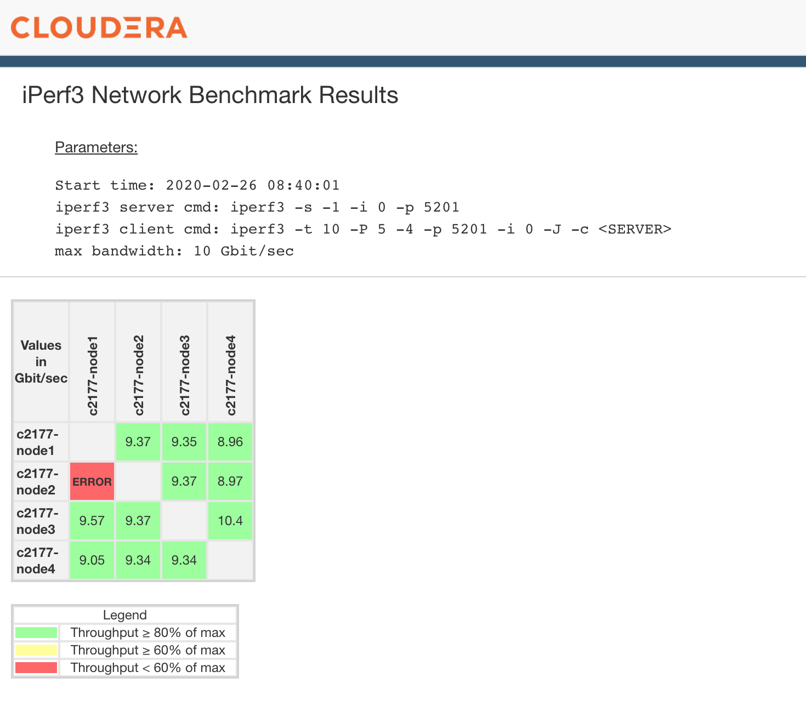

# iperf3-test-util
Utility scripts that use iperf3 to test the cluster network bandwidth. There are two main scripts:

### What's new?
26 Feb 2020 - Version 2.0:

* Updated the Cloudera logo to the new orange logo<br/>
* Improved the parse result python script to be more fault tolerant. Previous version of the script will error out if one of the iperf3 test failed [[Issue #1]](https://github.infra.cloudera.com/ckoh/iperf3-toolkit/issues/1)
* The launch-test.sh script now generates a tarball containing the iperf3 result output [[Issue #2]](https://github.infra.cloudera.com/ckoh/iperf3-toolkit/issues/2)
* The parse-result.py script now takes a tarball generated by the launch-test.sh script as a parameter (-f) [[Issue #2]](https://github.infra.cloudera.com/ckoh/iperf3-toolkit/issues/2)

### launch-test.sh
This is a iperf3 launcher script that is written in bash. It helps to automate the executation if the iperf3 server and client to each of the nodes in the cluster and collect the results in JSON format.

```
IPERF Cluster Network Benchmark Utility v2.0

USAGE:
  ./launch-test.sh [OPTIONS]

OPTIONS:
  -h, --hostfile <arg>
        File containing the list of hosts (default hosts.lst).

  -u, --sshuser <arg>
        User account used for SSH to the hosts. This account must be able to
        SSH without specifying a password.

IPERF OPTIONS:
  -p, --port <arg>
        Set server port to listen on/connect to (default 5201)

  -P, --parallel <arg>
        Number of parallel client streams to run (default 5).

  -t, --time <arg>
        Time in seconds to transmit for (default 10 secs).

```
***Examples:***

```
# Start iperf3 tests using a host file
$ cat hosts
node01.domain.org
node02.domain.org
node03.domain.org
$ ./launch-test.sh -h hosts -u root
```


### parse-result.py
This is a python script that process the JSON result files generated from the launcher script and output the results in a table format. Currently, only HTML format is supported but hopefully more output format will be added later.

```
usage: parse-result.py [-h] -d directory -bw bandwidth

iperf3-util result parser.

optional arguments:
  -h, --help     show this help message and exit
  -f tarfile     Zipped tarball of iperf3 test results
  -bw bandwidth  Theoretical maximum bandwidth for each hosts. E.g. 20 for
                 20Gbps
```

## Pre-requisites
### Supported Versions:
The toolkit has only been tested on the following version of the software:

* OS - RHEL/CentOS 7.5 - 7.6
* iperf version 3.1.7

Other operating systems and iperf3 version may work, but have not been tested.

### Install iperf3:
On RHEL 7 or CentOS 7, iperf3 is available in the base repository. Run "yum install iperf3" to install. You have to install iperf3 on all the nodes in the cluster that you intend to run the network bandwidth test on.

### Install RPM Manually:
Download the RPM from [https://iperf.fr/iperf-download.php]().


## HTML Sample Result Output


